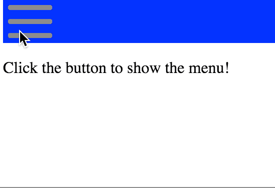

# Sandiwch Expando
## An Animated Sandwich-Button to X React Component



Installation: `npm install sandwich-expando -S`.

If you want to experiment locally, you can install `beefy` (`npm install -g beefy`), and then run `npm run sample` to run a live-reloading demo app.

You can edit `sample.js` to change the input parameters, or `index.js` to edit the module itself.

Example (copied from [sample.js](./sample.js))
```javascript
const render = require('react-dom').render
const h = require('react-hyperscript')

const Sandwich = require('sandwich-expando')

var body = document.querySelector('body')
const container = document.createElement('div')
body.appendChild(container)

let isOpen = true
let color = 'blue'

function reRender() {
  render(
    h(Sandwich, {
      width: 44,
      barHeight: 8,
      isOpen,
      color,
      onClick(event) {
        isOpen = !isOpen
        console.log(isOpen)
        reRender()
      },
    }),
  container)
}

reRender()
```
